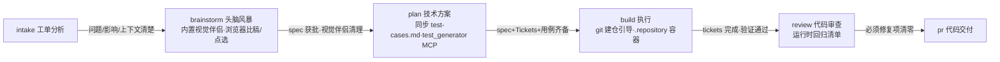

# tech-tower-workflow

「技术塔」：工单分析到代码交付的六步工程流水线，头脑风暴（brainstorm）步骤内置**技术塔视觉伴侣**——设计讨论中可以用浏览器向用户展示原型、图表与并排对比。

视觉伴侣自包含于 `visual-companion/`，**不依赖 superpowers 插件/技能**：代码改自 superpowers 6.2.0 的 brainstorming visual companion（MIT），已改名、移除原品牌/远程 logo/遥测相关逻辑，持久化路径改为 `.tech-tower/brainstorm/`。

## 流水线

```text
intake → brainstorm → plan → build → review → pr
工单分析   头脑风暴      技术方案      执行            代码审查   代码交付
          （视觉伴侣）  （+测试用例） （git 建仓引导+测试骨架）
```

- 每步强制绑定且只执行一个工程 Skill：`grill-with-docs` / `to-spec` / `to-tickets` / `implement` / `code-review`，pr 无绑定。
- spec 与 Tickets 统一保存在 `.scratch/<feature-slug>/`；全流程在同一个 Ticket Session 内推进。
- 本次扩展只增强 brainstorm 步骤，拓扑、绑定与产物约定不变。

## 流水线（mermaid）



> 单线串行流水线：节点内小字 = 该步骤内置的工具/产物，箭头上 = 该步骤的出口门槛。

## 包含的 Skills

| Skill | 位置 | 说明 |
|---|---|---|
| `tech-tower-workflow` | 根目录 `SKILL.md` | 主 skill：六步工程流水线 intake→brainstorm→plan→build→review→pr，内置视觉伴侣、git 建仓引导、测试用例集成、运行时回归纪律与每日更新检查 |
| `tech-tower-installer` | `installer/SKILL.md` | AI 自动安装 skill：环境自检测、确认 Agent 与安装范围、从 GitHub 下载安装、验证并清理 |

另含 Claude Code 插件包（`claude-plugin/`，由 `scripts/pack-claude-plugin.sh` 组装）：打包主 skill 并附 PreToolUse hook 禁止自动 git push。

## 视觉伴侣速览

1. 主题涉及视觉问题时，用一条**独立消息**征求同意（声明额外 token 成本），拒绝则纯文本继续。
2. 同意后启动（Claude Code / Codex 通用，脚本自动处理后台化）：
   ```bash
   visual-companion/scripts/start-server.sh --project-dir <项目根> --open
   ```
3. 用户在返回的本地 URL 中查看原型并点选，点击事件落在会话目录的 `.events`；连接信息在 `state/server-info`。
4. 逐问题决策浏览器还是终端，标准：**用户看到它是否比读到它更容易理解**。
5. 退出 brainstorm 前执行 `visual-companion/scripts/stop-server.sh "$SCREEN_DIR"`，原型保留在 `.tech-tower/brainstorm/`。

收尾前可选截取原型快照（须征得同意，告知 token 估算与存放路径），只截 `data-tt-screen` app 页面区域。

详见 `docs/brainstorm-visual-companion.md` 与 `visual-companion/GUIDE.md`。

## 安装

本仓库根目录即 skill 包（`SKILL.md` + `agents/openai.yaml`），当前版本 **v1.8.0**（版本号由 `scripts/sync-version.js` 统一维护）。支持 Codex 与 Claude Code 两大 Agent，提供三种安装方式：

### 方式一：npm 一键安装（推荐，需 Node ≥ 18）

```bash
npx tech-tower-workflow                    # 项目级：自动检测 Codex / Claude Code 并装到当前项目
npx tech-tower-workflow --global           # 全局：装到用户级目录，所有项目共享
npx tech-tower-workflow --tool claude      # 检测不到时显式指定目标（codex / claude）
npx tech-tower-workflow --uninstall        # 卸载（加 --global 卸载全局安装）
```

| Agent | 项目级 | 全局 |
|---|---|---|
| Codex | `.codex/skills/tech-tower-workflow/` | `$CODEX_HOME/skills/tech-tower-workflow/`（默认 `~/.codex`） |
| Claude Code | `.claude/skills/tech-tower-workflow/` | `~/.claude/skills/tech-tower-workflow/` |

安装为镜像覆盖（先清旧目录再整体复制，无旧版本残留）；Codex 目标自动排除 `claude-plugin/` 避免嵌套 SKILL.md 被扫成重复 skill；项目级安装拒绝在 `~` 下执行（防污染全局，`--force` 可解除）。未发布到 npm registry 前，可用 `npx github:zerotower69/tech-tower-workflow` 直接从 GitHub 运行同一安装器。

### 方式二：AI 自动安装

把这句话原样发给你的 AI（Codex / Claude Code 等）：

> 请读取 https://raw.githubusercontent.com/zerotower69/tech-tower-workflow/main/installer/SKILL.md 并按它自动完成技术塔工作流的安装。

AI 会自动检测环境与项目中已用的 Agent（Codex / Claude Code 两大 Agent），确认范围后从 GitHub 下载压缩包安装到对应 skills 目录，验证并清理；完整规程见 `installer/SKILL.md`。

### 方式三：手动安装（无需 Node）

```bash
./install.sh   # macOS / Linux / Git Bash：安装到 $CODEX_HOME/skills/tech-tower-workflow
```

```powershell
powershell -ExecutionPolicy Bypass -File install.ps1   # Windows：等价安装
```

Windows 说明：安装用 `install.ps1`；视觉伴侣等运行时脚本在 Git Bash/MSYS 下已自动适配，纯 PowerShell 环境可直接 `node visual-companion/scripts/server.cjs` 前台启动。

Claude 安装目录自包含全部材料与脚本，可整目录拷贝移植；Codex 安装目录排除 `claude-plugin/`、`.claude-plugin/`（避免嵌套 SKILL.md 被扫成重复 skill）与 npm 工程产物（`bin/`、`plugin-src/` 等），其余齐全。

安装后对 Agent 说「用技术塔工作流处理：<需求>」即可触发；版本与变更见 `SKILL.md` 版本历史，git tag 与版本号同步（`vX.Y.Z`）。

### Claude Code 插件（v1.1.0+）

`claude-plugin/` 为 Claude Code 插件包（由 `scripts/pack-claude-plugin.sh` 从源文件组装，勿手改）：

```bash
claude plugin install ./claude-plugin   # 或加入 marketplace 后安装
```

内置 **PreToolUse hook 禁止自动 git push**：Agent 只有在用户当轮消息显式包含 push/推送 时才能执行 `git push`，否则被阻断并提示确认。

## 本地测试

一键冒烟测试（启动 → 鉴权 → 品牌渲染 → 内容页 → 模拟点击事件落盘 → 停止，无需人工交互；依赖 Node 22+ / curl / python3）：

```bash
visual-companion/smoke-test.sh
```

手工测试（真实浏览器）：

1. 启动服务器并自动打开浏览器：
   ```bash
   visual-companion/scripts/start-server.sh --project-dir <项目根> --open
   ```
2. 往会话目录的 `content/` 写任意 HTML 片段（无需 `<html>` 包裹，如 `layout.html`），页面会自动展示最新文件；选项用 `<div class="option" data-choice="a" onclick="toggleSelect(this)">` 结构。
3. 在页面上点击选项，然后查看 `<会话目录>/state/events` 里的点击事件（JSONL，每行一个）。
4. 停止：`visual-companion/scripts/stop-server.sh <会话目录>`。

注意：`/tmp`（含系统临时目录）下的会话为一次性会话，停止时清理；使用真实项目目录则原型持久化在 `.tech-tower/brainstorm/`。

## 维护者发版流程

```bash
npm version patch   # 或 minor / major：自动改 package.json 并同步全部版本位点（.npmrc 已禁用自动 tag）
# 手工在 SKILL.md「版本历史」补一条 vX.Y.Z 记录
./scripts/pack-claude-plugin.sh && ./install.sh   # 重组 Claude 插件包并同步本机全局安装
git commit -am "feat: vX.Y.Z ..." && git tag -a vX.Y.Z -m "vX.Y.Z"   # push 需用户确认
```

版本位点清单见 `.version-bump.json`；同步脚本 `scripts/sync-version.js` 可单独运行做校验。

## 许可与来源

MIT（见 `LICENSE`）。`visual-companion/` 改自 [superpowers](https://github.com/obra/superpowers)（Copyright (c) 2025 Jesse Vincent，MIT）的 brainstorming visual companion；保留原版权声明，改动：重命名为「技术塔视觉伴侣」、存储路径 `.superpowers/brainstorm/` → `.tech-tower/brainstorm/`、移除远程品牌图与遥测相关代码。

## 注意

- `archive/` 存放历史来源文档（含原内部引用），非产品面、不打包进 skill/插件；仓库保持私有。
- workflow YAML 遵循已定稿的 topology 契约：每个非 terminal 节点恰好一条前向 Rule，`when` 为自然语言、由 AI 判断。
