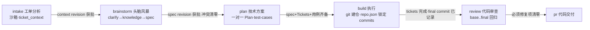

# Zflow

「技术塔」现在包含两个边界清晰的 skill：用于代码交付的六步工程流水线，以及可单独完成 UI/UX 设计的**技术塔视觉伴侣**。只想做界面设计时，不必进入 plan、build、review 或 pr。

视觉伴侣自包含于 `skills/zflow/visual-companion/`，**不依赖 superpowers 插件/技能**：代码改自 superpowers 6.2.0 的 brainstorming visual companion（MIT），已改名、移除原品牌/远程 logo，持久化路径改为 `.tech-tower/brainstorm/`。埋点默认只写本地 JSONL；只有显式配置 endpoint 才会发送经过隐私过滤的事件。

## 流水线

```text
intake → brainstorm → plan → build → review → pr
工单分析   头脑风暴      技术方案      执行            代码审查   代码交付
          （视觉伴侣）  （+测试用例） （git 建仓引导+测试骨架）
```

v1.14.0 起，六步流程由可迁移沙箱内核提供机器可读状态：context 确认后经过 clarify → knowledge → spec 检查点，再进入一对一 Plan。阶段迁移、revision、事件、回退、Git 证据和交接不再只依赖 Markdown 纪律。

## 可迁移工作流沙箱

```bash
zflow-sandbox create my-ticket --root .scratch
zflow-sandbox status .scratch/my-ticket --json
zflow-sandbox validate .scratch/my-ticket --strict --json
zflow-sandbox pack .scratch/my-ticket --output my-ticket.tws
```

`.tws` 默认只保存工作流产物与完整 Commit 引用；未推送 Commit、已跟踪未提交改动和重要未跟踪文件会分别通过 Git bundle、binary patch 和 payload 保护。恢复会拒绝摘要损坏、路径穿越、非空目标和冲突，不自动覆盖工作区。详见 `skills/zflow/docs/portable-sandbox.md`。

- 每步强制绑定且只执行一个工程 Skill：`grill-with-docs` / `to-spec` / `to-tickets` / `implement` / `code-review`，pr 无绑定。
- intake 会先把任务首次启动时给到的信息固化为 `.scratch/<feature-slug>/ticket_context.md`；确认后作为后续阶段的只读上下文基线。
- build 会创建并持续补齐 `.scratch/<feature-slug>/repo.json`：按仓库记录施工分支和 `base_commit`，每次 Ticket 提交刷新 `head_commit`/checkpoints，交付时记录 `final_commit`，供 review/pr 锁定 diff 边界。
- ticket_context、spec 与 Tickets 统一保存在 `.scratch/<feature-slug>/`；全流程在同一个 Ticket Session 内推进。

## 流水线（mermaid）



> 单线串行流水线：节点内小字 = 该步骤内置的工具/产物，箭头上 = 该步骤的出口门槛。

## 包含的 Skills

| Skill | 位置 | 说明 |
|---|---|---|
| `zflow` | `skills/zflow/SKILL.md` | 六步工程执行流水线 intake→brainstorm→plan→build→review→pr，负责代码、测试、审查与交付 |
| `zflow-vision` | `skills/zflow-vision/SKILL.md` | 独立 UI/UX 设计闭环：浏览器比稿、点选、迭代、原型与 design-spec 交付，不自动进入开发 |

另含 Claude Code 插件包（`claude-plugin/`，由 `scripts/pack-claude-plugin.sh` 组装）：打包主 skill 并附 PreToolUse hook 禁止自动 git push。

## 视觉伴侣速览

### 只做 UI 设计

直接说：

> 用技术塔视觉伴侣完成 UI 设计：<需求>

它会独立完成上下文读取、视觉方向比稿、逐屏迭代、状态补齐与 `design-spec.md` 交付，不创建 Tickets、不建仓、不实现业务代码。详见 `skills/zflow-vision/SKILL.md`。

### 工程流水线中的视觉决策

1. 主题涉及视觉问题时，用一条**独立消息**征求同意（声明额外 token 成本），拒绝则纯文本继续。
2. 同意后启动（Claude Code / Codex 通用，脚本自动处理后台化）：
   ```bash
   skills/zflow/visual-companion/scripts/start-server.sh --project-dir <项目根> --open
   ```
3. 用户在返回的本地 URL 中查看原型并点选；可收起悬浮球使用离线 Popper.js 自动避让定位，提供逐页 PNG/HTML、全量设计交付站导出、取色、实时逐轮 Token 与埋点摘要，反馈事件落在 `state/events`，完整分析事件持续追加到 `state/analytics.jsonl`。服务器断连时页面继续显示，仅用状态和提示告知自动重连。
4. 逐问题决策浏览器还是终端，标准：**用户看到它是否比读到它更容易理解**。
5. 退出 brainstorm 前执行 `skills/zflow/visual-companion/scripts/stop-server.sh "$SCREEN_DIR"`，原型保留在 `.tech-tower/brainstorm/`。

收尾前可选截取原型快照（须征得同意，告知 token 估算与存放路径），只截 `data-tt-screen` app 页面区域。悬浮球按插件注册：内置页面、PNG 导出、HTML 导出、导出所有、取色器和实时逐轮 Token 统计；后续工具可通过 `brainstorm.plugins.register(...)` 扩展。弹窗定位使用 `@popperjs/core`，PNG 使用 `html-to-image`，Token 估算使用 `gpt-tokenizer`；这些依赖均构建后随 skill 离线分发。每个语义页面自动形成一个视觉轮次，宿主传入 `turnId` / `turnIndex` 时显示对应官方 usage，否则明确标记为页面与交互估算。全量导出会生成含全部页面、设计决策与聚合埋点摘要的可移植 Express 静态站，复制目录后执行 `node serve.cjs --open` 即可查看；脚本入口为 `visual-companion/scripts/export-design-site.cjs --session-dir <会话目录>`。

详见 `skills/zflow/docs/brainstorm-visual-companion.md` 与 `skills/zflow/visual-companion/GUIDE.md`。

## 安装

本仓库为多 skill 包（`skills/` 目录下每个子目录一个 skill），当前版本 **v1.19.0**（版本号由 `scripts/sync-version.js` 统一维护）。支持 Codex、Claude Code 等 Skills CLI 兼容 Agent。

### Skills CLI 标准安装（推荐，需 Node ≥ 18）

```bash
npx skills add zerotower69/tech-workflow
```

这是主流 Skills CLI 的交互式安装入口：命令行会让用户选择 skill、目标 Agent 和安装范围，然后确认写入。仓库没有自定义安装器，也不会先把某个 Markdown 识别并安装成“安装 skill”。

按需选择或用于自动化：

```bash
npx skills add zerotower69/tech-workflow --skill zflow
npx skills add zerotower69/tech-workflow --skill zflow-vision
npx skills add zerotower69/tech-workflow --global
npx skills add zerotower69/tech-workflow --skill '*' --agent codex claude-code --global --yes
```

默认安装到项目统一目录 `.agents/skills/`；`--global` 安装到用户级目录。`--yes` 只用于 CI 或用户已明确授权的非交互安装。若不希望 Skills CLI 发送匿名使用统计，可设置 `DISABLE_TELEMETRY=1`。

每个 skill 的安装目录自包含全部材料与脚本，可整目录拷贝移植。

安装后按目标选择入口：「用技术塔工作流处理：<需求>」用于工程交付；「用技术塔视觉伴侣完成 UI 设计：<需求>」用于只做设计。版本与变更见 `skills/zflow/SKILL.md` 版本历史，git tag 与版本号同步（`vX.Y.Z`）。

### Claude Code 插件（v1.1.0+）

`claude-plugin/` 为 Claude Code 插件包（由 `scripts/pack-claude-plugin.sh` 从源文件组装，勿手改）：

```bash
claude plugin install ./claude-plugin   # 或加入 marketplace 后安装
```

内置 **PreToolUse hook 禁止自动 git push**：Agent 只有在用户当轮消息显式包含 push/推送 时才能执行 `git push`，否则被阻断并提示确认。

## 本地测试

一键冒烟测试（启动 → 鉴权 → 品牌渲染 → 内容页 → 模拟点击事件落盘 → 停止，无需人工交互；依赖 Node 22+ / curl / python3）：

```bash
skills/zflow/visual-companion/smoke-test.sh
```

手工测试（真实浏览器）：

1. 启动服务器并自动打开浏览器：
   ```bash
   skills/zflow/visual-companion/scripts/start-server.sh --project-dir <项目根> --open
   ```
2. 往会话目录的 `content/` 写任意 HTML 片段（无需 `<html>` 包裹，如 `layout.html`），页面会自动展示最新文件；选项用 `<div class="option" data-choice="a" onclick="toggleSelect(this)">` 结构。
3. 在页面上点击选项，然后查看 `<会话目录>/state/events` 里的点击事件（JSONL，每行一个）。
4. 停止：`skills/zflow/visual-companion/scripts/stop-server.sh <会话目录>`。

注意：`/tmp`（含系统临时目录）下的会话为一次性会话，停止时清理；使用真实项目目录则原型持久化在 `.tech-tower/brainstorm/`。

## 维护者发版流程

发布由 `.github/workflows/publish-npm.yml` 在新版本 tag 推送时自动完成。普通 `main` push 和 PR merge 不会直接发包。

```bash
npm test && npm run test:skills
git push origin main
# tag 是发布版本的唯一来源；无需手改 package.json
git tag -a vX.Y.Z -m "vX.Y.Z"
git push origin vX.Y.Z
```

Action 从 `v<semver>` tag 解析版本，在 Runner 内自动更新 `package.json`、两个 skill 和插件清单，重建 Claude 插件后再执行测试、Skills CLI 标准首装、pack 内容校验与发布。仓库中的旧版本号不会限制发布版本，也不会由 Action 反向提交代码。

tag 遵循 SemVer 2.0.0，例如正式版 `v1.17.0`、预发布版 `v2.0.0-rc.1`、带构建元数据的 `v1.17.0+build.3`；非法前导零会被拒绝。正式版发布到 npm `latest`，预发布版发布到 `next`。tag commit 必须已进入 `origin/main`，且 registry 中不得存在同版本；任何校验失败都不会发布。

GitHub Actions 使用 npm Trusted Publishing（OIDC），不读取 `NPM_TOKEN`。包已经存在后，在 npm 包设置的 Trusted Publisher 中绑定 GitHub Actions：owner `zerotower69`、repository `tech-workflow`、workflow `publish-npm.yml`，environment 留空，并只允许 `npm publish`。仓库 workflow 已提供 `id-token: write`，使用 GitHub-hosted runner、Node 24 与支持 OIDC 的 npm。

全新包在 npmjs 上还没有设置页，第一次发布必须先在维护者本机交互完成一次：

```bash
npm login --registry=https://registry.npmjs.org
npm whoami --registry=https://registry.npmjs.org
npm publish --access public
```

浏览器/OTP 只发生在这次本机首发。首发成功后立即配置上述 Trusted Publisher；从下一个新版本 tag 开始由 Action 通过 OIDC 发布。如果仓库曾创建 `NPM_TOKEN`，可在确认 workflow 不再引用后删除它。已存在的 npm 版本不可覆盖，首发成功后不要重跑同版本发布 job。

版本位点清单见 `.version-bump.json`；同步脚本 `scripts/sync-version.js` 可单独运行做校验。

## 许可与来源

MIT（见 `LICENSE`）。`skills/zflow/visual-companion/` 改自 [superpowers](https://github.com/obra/superpowers)（Copyright (c) 2025 Jesse Vincent，MIT）的 brainstorming visual companion；保留原版权声明，改动：重命名为「技术塔视觉伴侣」、存储路径 `.superpowers/brainstorm/` → `.tech-tower/brainstorm/`、移除远程品牌图与遥测相关代码。

## 注意

- `archive/` 存放历史来源文档（含原内部引用），非产品面、不打包进 skill/插件；仓库保持私有。
- workflow YAML 遵循已定稿的 topology 契约：每个非 terminal 节点恰好一条前向 Rule，`when` 为自然语言、由 AI 判断。
