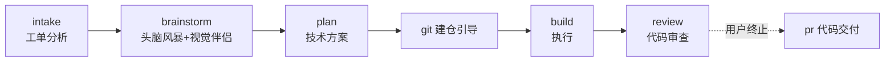

# Demo：用技术塔工作流创建一个小程序

> 真实用例复盘：从一句话需求到可运行的微信小程序，全程走 `intake → brainstorm → plan → build → review` 流水线。
> 需求输入：**「用一个小程序一级入口页面设计来做测试用例，使用这个工作流」**

## Step 0 · 创建确定性沙箱（v1.14.0+）

```bash
node skills/tech-workflow/scripts/sandbox/cli.cjs create mp-entry-page --root .scratch --title "小程序一级入口页面"
```

后续每次批准产物或进入下一阶段，都通过 `revise` / `approve` / `transition` 写入 revision 与事件。恢复会话先运行 `status`、`validate` 并读取 `handoff.md`；完整命令见 `docs/portable-sandbox.md`。

## 成果概览

| 产物 | 位置 |
|---|---|
| 初始上下文快照 ticket_context | `mp-entry-testcase/.scratch/mp-entry-page/ticket_context.md` |
| 仓库施工边界 repo.json | `mp-entry-testcase/.scratch/mp-entry-page/repo.json` |
| 设计规格 spec + 方案稿（HTML/PNG） | `mp-entry-testcase/.scratch/mp-entry-page/` |
| 实现计划 plan（9 tickets） | 同上 `plan.md` |
| 可运行原生小程序「一叶轻食」（30 文件） | `mp-entry-testcase/.repository/yiye-light-food/` |



## Step 1 · intake 工单分析

- 任何追问前先创建 `ticket_context.md`，记录用户原始一句话需求、点名的测试用途、启动工作目录、可见工程状态与当时未知项；用户确认后不再用后续设计结论覆盖它。
- 需求只有一句话，领域拷问补齐上下文：业务设定为**本地餐饮店、单店私域**（堂食扫码 + 外卖/自提）。
- 产出：已确认的初始上下文快照 + 清晰的问题定义与影响范围 → 满足进入 brainstorm 的 rule。

## Step 2 · brainstorm 头脑风暴（视觉伴侣主场）

**征求同意**：用一条独立消息说明「涉及视觉讨论，将启用浏览器视觉伴侣（有额外 token 成本）」，用户回复 `yes`。

**启动**：

```bash
visual-companion/scripts/start-server.sh --project-dir <项目根> --open
```

得到带 key 的本地 URL，用户在浏览器打开伴侣页面。

**逐轮收敛**（一次只问一个问题；视觉问题走浏览器，业务问题走终端）：

| 轮次 | 议题 | 形式 | 用户回复 |
|---|---|---|---|
| 1 | 服务模式 | 终端文本 | 单店私域 |
| 2 | 视觉风格三选一 | **浏览器**比稿卡片 | `C`（清新轻食风） |
| 3 | 入口结构 | **浏览器**结构对比 | 自定义：「首页放中间，凸起」 |
| 3b | 凸起结构 v2 方案 A | **浏览器** | `A` |
| 4 | 最终首页布局 | **浏览器**分 2 节展示 | `y，记得存图` |

每轮把方案写成 HTML 片段放进会话目录 `content/`，浏览器实时渲染；用户点选事件落盘 `state/events`。

**收尾**：写 `spec.md`（决策表、信息架构、首页布局、视觉规格 #5F7D5A 体系、关键状态、验收标准 7 条）→ 自检 → 用户审查门 `yes` → `stop-server.sh` 停服清理（原型持久化在 `.tech-tower/brainstorm/`）。

## Step 3 · plan 技术方案

在 spec 基础上拆 **9 个 tickets**：骨架/视觉变量 → 凸起 tab bar → 顶栏切换 → 订单状态条 → chips+菜品流 → 售罄/异常 → 点单页 → 我的页 → 视觉走查。每个 ticket 绑定 spec 验收条目，标注依赖顺序与验证策略。用户审查门 `ok`。

## Step 4 · build 执行

**git 环境检查（build 前置步骤，见 `docs/build-git-bootstrap.md`）**：

检测到目标目录不在任何仓库内 → 逐条引导：

1. 仓库命名与位置 → 采用 `.repository/` 容器约定（可放多个仓库），仓库 = `.repository/yiye-light-food`
2. local user.name/email → 沿用全局
3. 默认分支 → `master`
4. .gitignore → 用户选不需要
5. 远程 → 暂不关联

`git init -b master` + 首次提交后才动代码。

首次提交后创建 `repo.json`：记录仓库 `.repository/yiye-light-food`、分支 `master`、空 remotes，并以首次提交 SHA 作为 `base_commit`；此时 `final_commit` 为 `null`。

**逐 ticket 实施**：30 个文件（app.json 声明 3 tab + custom-tab-bar；首页自定义导航承载店名与自提/外卖切换；mock 数据支撑全部状态演示）。每个 Ticket 提交后立即刷新 `repo.json.head_commit`，并向 `checkpoints` 追加 Ticket、commit、时间和摘要，不能等 build 结束再补写。

验证完成后提交全部 Ticket 改动，将当前 `HEAD` 写入 `repo.json.final_commit`，供 review 使用 `base_commit..final_commit` 精确审查。

## Step 5 · review 代码审查

独立走查 spec §6 验收标准，**发现并修复 3 个真实问题**：

1. tab 切换每次重放骨架屏 → 首次加载后缓存菜品；
2. 领券分支无法演示 → mock 增加 `SIMULATE_NO_ORDER` 开关；
3. 自提/外卖切换不过滤菜品 → 4 道菜标记外送不可用，首页与点单页同步过滤。

修复提交并复核后刷新 `repo.json.final_commit`，确保它等于仓库当前 `HEAD`。

**验证证据**（静态校验，编译≠运行时证明，DevTools 验证留给用户）：

- 9 份 JSON 配置解析 ✓
- 8 个 JS `node --check` ✓
- WXML 标签配对 + 路由一致性 ✓
- 色值走查：仅 #5F7D5A 体系；阴影仅轻阴影 + 凸起浮影 ✓

## 关键纪律复盘

- **一次一问**：用户全程只需回复字母/单词（`C`、`A`、`yes`、`ok`），交互成本极低。
- **HARD-GATE**：spec 未批准不写 plan，plan 未批准不动代码。
- **浏览器 vs 终端逐问题判断**：风格/结构/布局「看到」比「读到」容易 → 浏览器；业务模式「读到」就够 → 终端。
- **git 底座先行**：没有版本管理不写第一行代码。
- **验证分层**：静态校验是证据之一，运行时验证（DevTools）单独声明，不冒充。

## 如何复现

1. 本仓库装入你的 Agent（Claude Code / Codex）。
2. 对 Agent 说：`用技术塔工作流处理：<你的一句话需求>`。
3. 按各步骤的审查门回复即可；涉及视觉时同意启用视觉伴侣。
