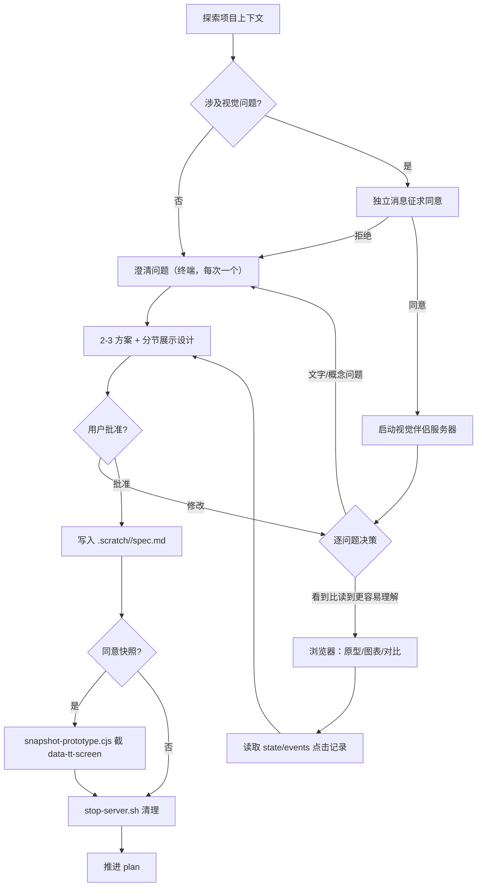

# brainstorm 步骤指令（to-spec × 视觉伴侣）

> 适用范围：技术塔 workflow 的 `brainstorm`（头脑风暴）步骤。
> 视觉伴侣实现：本仓库 `visual-companion/`（改自 superpowers 6.2.0 的 brainstorming visual companion，MIT 许可，已改名并移除原品牌与远程资源依赖）。
> 权威产物不变：`.scratch/<sandbox-id>/spec.md`（由 `to-spec` 产出）。

## 一、与流水线的关系

- 步骤集合、Skill 绑定、产物约定、Session 模型均不变；仅增强 brainstorm 步骤指令。
- 视觉伴侣是**工具而非模式**：主题不涉及视觉、或用户不同意时，行为与原工作流完全一致。
- 视觉伴侣交互发生在 brainstorm 步骤内部，不新增 workflow 节点，不改变拓扑。

## 二、执行顺序

1. **探索项目上下文** — 检查文件、文档、最近的 commit。
2. **判断是否涉及视觉问题** — UI 原型/线框图、布局与导航结构、架构图/数据流、并排视觉对比、状态机/ER 等空间关系。注意：UI 主题的问题不一定是视觉问题——「个性化在这个上下文里是什么意思？」是概念问题，用终端；「哪种向导布局更好？」是视觉问题，用浏览器。
3. **涉及视觉 → 发送独立提议消息**（见下）；不涉及 → 直接进澄清问题。
4. **澄清问题** — 每次一个，优先选择题，理解目的/约束/成功标准。
5. **提出 2-3 种方案** — 附权衡与推荐，先讲推荐项。
6. **分节展示设计** — 篇幅与复杂度匹配，每节获得用户确认。
7. **写入 spec** — `.scratch/<sandbox-id>/spec.md`，用户批准后本步骤才可完成。
8. **收尾清理** — 若启用过视觉伴侣，停止服务器（见第五节）。

## 三、征求同意（必须是独立消息）

此提议必须是**一条独立的消息**，不得与澄清问题、上下文摘要或任何其他内容合并。等待用户回复后再继续；拒绝则继续纯文本头脑风暴。

模板：

> 我们接下来讨论的一些内容，如果能在浏览器中展示给你看可能会更直观。我可以在讨论过程中为你制作原型、图表、对比图和其他视觉材料。这个功能还比较新，可能会消耗较多 token。要试试吗？（需要打开一个本地 URL）

## 四、视觉伴侣运行手册

### 启动（仅在用户同意后）

```bash
visual-companion/scripts/start-server.sh --project-dir <workspace 根目录>
```

- 返回 JSON 中记录 `screen_dir`，并请用户打开返回的 URL。
- 传入 `--project-dir` 使原型持久化在 `<workspace>/.tech-tower/brainstorm/`；不传则落在 `/tmp`，清理即丢失。
- 提醒将 `.tech-tower/` 加入 `.gitignore`（如尚未添加）。
- 运行时差异：后台进程会被回收的环境改用 `--foreground` + 平台后台执行机制；远程/容器环境浏览器无法访问回环地址时用 `--host 0.0.0.0 --url-host localhost`。
- 错过 stdout 时读取 `$SCREEN_DIR/.server-info` 获取 URL 与端口。
- 每次启动会把页面框架模板与客户端脚本复制进会话目录（[frame-template.html](../visual-companion/scripts/frame-template.html)、[helper.js](../visual-companion/scripts/helper.js) 的副本），服务器优先读会话内副本，项目会话因此自包含、可离线回看。

### 逐问题决策：浏览器还是终端

判断标准：**用户看到它是否比读到它更容易理解？**

- **浏览器**：原型、线框图、布局对比、架构图、并排视觉设计。
- **终端**：需求问题、概念选择、权衡列表、A/B/C 文字选项、范围决策。

### 内容规范

- 默认只写内容片段（服务器自动包裹框架模板）；仅当以 `<!DOCTYPE` / `<html` 开头时才按完整文档原样提供。
- 每屏 2-4 个选项；在页面上解释问题本身，而不是只让用户「选一个」。
- 语义化文件名（`layout.html`、`visual-style.html`），绝不复用文件名；迭代加 `-v2`、`-v3` 后缀，服务器按修改时间提供最新文件。
- 保真度匹配问题：布局问题用线框图，细节打磨用精细设计；必要时用真实内容，占位内容会掩盖设计问题。

### 事件读取

- 用户点击记录在会话目录的 `state/events`（`$STATE_DIR/events`）（JSONL：`type/choice/text/timestamp`），推送新屏幕时自动清空。
- 每轮读取一次：最后一个 `choice` 事件通常是最终选择，点击模式可揭示犹豫；文件不存在说明用户未与浏览器交互，仅以终端文字为准。

## 五、收尾（退出 brainstorm 前必做）

```bash
visual-companion/scripts/stop-server.sh "$SCREEN_DIR"
```

- `--project-dir` 会话的原型保留在 `.tech-tower/brainstorm/` 供日后参考；`/tmp` 会话停止时删除。
- `spec.md` 中记录会话目录，并链接原型页面副本：`[原型页面](<workspace>/.tech-tower/brainstorm/<session-id>/frame-template.html)`（用项目内相对路径），便于日后在工程中直接回看。
- 确认 `.scratch/<sandbox-id>/spec.md` 已写入并获用户批准，方可上报步骤完成。
- 若用户同意原型快照，先完成快照（见第九节）再 stop-server。

## 六、HARD-GATE（沿袭头脑风暴设计）

在设计方案展示并获得用户批准之前，不得调用任何实现技能、编写任何代码或采取任何实现行动。与技术塔「每步只执行一个绑定 Skill、禁止越阶段执行」的约束叠加生效。

## 七、brainstorm 内部子流程



## 八、集成要求与风险

1. **Skill 可用性**：视觉伴侣已内置于本仓库 `visual-companion/`（`GUIDE.md` + `scripts/`）；若集成进 harness sandbox，需将该目录加入注入清单或挂载进 sandbox。
2. **步骤 outcome 语义**：视觉伴侣交互轮次应返回 `waiting_for_input`；只有 spec 写入并获批准才允许 `completed`。避免既有缺陷「provider turn success 被当作 step completed」（见来源文档第四节）。
3. **产物校验**：声称产出 spec 的步骤需校验 `.scratch/<sandbox-id>/spec.md` 真实存在（findings 的 P0 建议）。
4. **成本披露**：提议模板已声明「可能消耗较多 token」，必须经用户同意才启用。
5. **展示标签**：原 findings 指出「头脑风暴」标签与 `to-spec` 产物语义不一致；本次增强强化了 brainstorm 语义。若后续改名对齐，标签与本指令需同步调整。

## 九、原型快照（可选 · 必须征得同意）

时机：spec 获批后、stop-server 之前。征求同意须独立消息，包含三要素：
- **范围**：只截 app 页面区域——`[data-tt-screen]` 元素（缺失回退 `#frame-content`），不截整页；
- **预计消耗**：截图本身为无头浏览器行为，≈0 tokens；后续读回上下文约 `ceil(w×h/750)` tokens/张（390×844 ≈ 440 tokens）；
- **存放路径**：`.scratch/<sandbox-id>/mockups/snapshot-<序号>.png`。

同意后执行（或浏览器 MCP 如 playwriter 做等价 element 截图）：

```bash
node visual-companion/scripts/snapshot-prototype.cjs --url <原型URL> --out <存放路径>
```

mockup 生成约定：app 页面区域一律用 `<div data-tt-screen>…</div>` 包裹（见 `visual-companion/GUIDE.md`）。
快照用途：plan/build 列为视觉参考；review 与运行时实机表现逐条对照。
